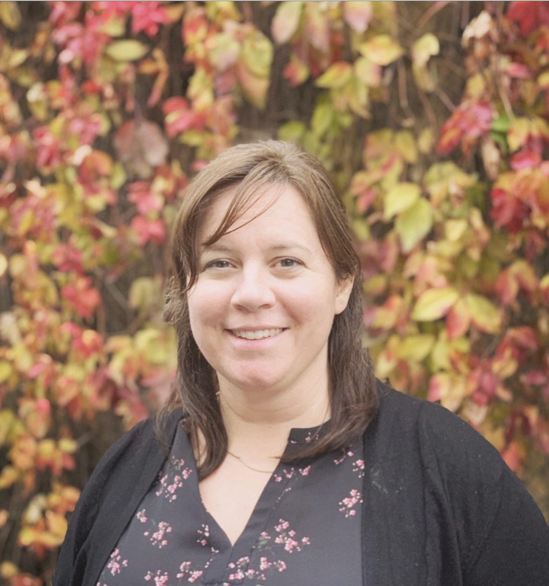

#### Biosketch

Christine Rogers is a Research Project Officer at the McGill Centre of Integrative Neuroscience ([MCIN](http://mcin.ca)) at the Montreal Neurological Institute. She serves as the Lead of several open-source neuroinformatics initiatives with the [LORIS open database](http://LORIS.ca) team, and currently contributes expertise to the management of the [Global Brain Consortium](http://globalbrainconsortium.org) and [EEGNet](http://EEGNet.org), a Canadian-funded initiative to build gold-standard open annotated datasets and processing workflows in electrophysiology for applications in global health. Her open science leadership roles have included platforms and initiatives such as the [MNI Open iEEG Atlas](https://mni-open-ieegatlas.research.mcgill.ca), the Open Sleep Atlas, and more.

Her technical work has largely focused on integration of data workflows and modalities for genomics and electrophysiology into online data platforms for remote collaboration, in domains such as autism, epilepsy, stroke, and more. 
Her experience includes over 20 years in software - over 15 years in research software and 10 years in open-source, in addition to 5 years in industry. Her academic and technical background includes neuroimaging, computational linguistics, machine learning, and aerospace. 

She has mentored 6 times for Google Summer of Code and Season of Docs programs for open-source software projects. 
Most recently, she has taken on the Global Brain Consortium remote events leadership and execution. She was an invited presenter and mentor at the Neuro's Open Science in Action 2020 conference, and particpated in the 2020 OpenLifeSci cohort.  Past event organization includes Machine Learning workshops, neuroinformatics conference events, and community engagement.
